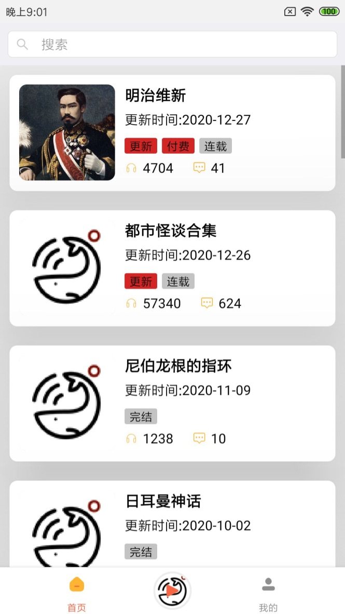

# FishInTroubled
浑水摸鱼APP build for ReactNative & Typescript  
内容来源[渾水摸魚](https://imayu.com/) 
> 水至清則無魚，人至察則無徒

# screenshot

# Running
## Clone & install
* Clone this repo git clone 
* cd FinanceReactNative
* > npm install
## IOS
没有进行过调试，可能会有些问题
> npm run ios
## Android
> npm run android
## 生成字体
npx iconfont-rn
